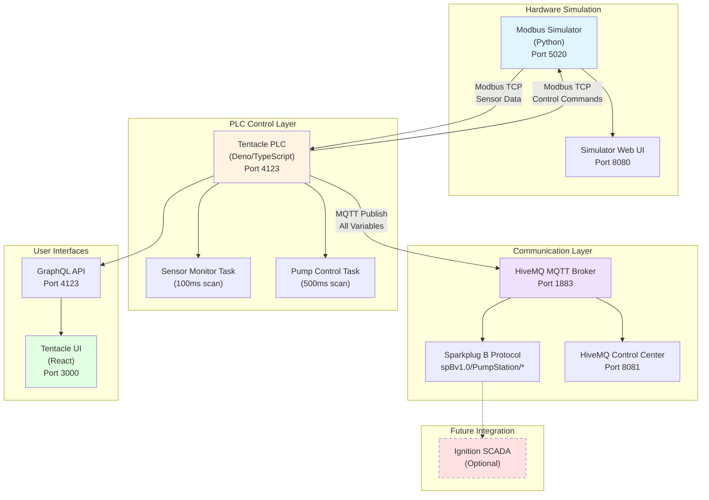

# Pump Station Tentacle PLC App

Pump station PLC control system using Tentacle PLC framework with Modbus I/O and MQTT Sparkplug B communication.

## Overview

This project implements a complete pump station control system with the following components:
- **Modbus Simulator**: Python-based pump station hardware simulator
- **Tentacle PLC**: Deno-based soft PLC runtime executing control logic
- **Tentacle UI**: React-based web interface for monitoring and control
- **HiveMQ MQTT Broker**: MQTT broker for Sparkplug B data publishing

## System Architecture



### Data Flow

1. **Sensor Reading**: Modbus Simulator generates realistic sensor data (pressure, flow, temperature)
2. **PLC Processing**: Tentacle PLC reads sensors via Modbus TCP and executes control logic
3. **Control Output**: PLC sends pump control commands back to simulator via Modbus
4. **Data Publishing**: All variables automatically published to HiveMQ via Sparkplug B
5. **User Monitoring**: Tentacle UI displays real-time data via GraphQL subscriptions
6. **Future SCADA**: Ignition can subscribe to Sparkplug B topics for advanced visualization

## Quick Start

### Prerequisites
- Docker and Docker Compose installed
- Deno 2.x installed (for local development)
- Access to the pump station simulator image from GitHub Container Registry

### Setup Steps

1. **Clone the Repository**:
   ```bash
   git clone <repository-url>
   cd pump-station-tentacle-plc
   ```

2. **Create Environment File**:
   ```bash
   cp .env.example .env
   ```

3. **Start All Services**:
   ```bash
   docker compose up -d
   ```

4. **Verify Services Are Running**:
   ```bash
   docker compose ps
   ```
   All services should show status as "running" or "healthy".

### Access Services
- **Tentacle UI**: http://localhost:3000 - PLC monitoring web interface
- **GraphQL API**: http://localhost:4123/graphql - Real-time data queries and subscriptions
- **Modbus Simulator UI**: http://localhost:8080 - Simulator control interface
- **HiveMQ Control Center**: http://localhost:8081 - MQTT monitoring interface (admin/hivemq)

## Service Ports

| Service | Port | Purpose |
|---------|------|---------|
| Tentacle UI | 3000 | PLC monitoring web interface |
| GraphQL API | 4123 | Real-time data queries and subscriptions |
| Modbus Simulator | 5020 | Modbus TCP communication |
| Simulator Web UI | 8080 | Simulator control interface |
| HiveMQ MQTT | 1883 | MQTT broker (Sparkplug B) |
| HiveMQ Control Center | 8081 | MQTT monitoring interface |

## System Architecture

### Control System
The Tentacle PLC implements a pump station control system with the following features:

**Sensor Monitoring** (100ms scan rate):
- Suction Pressure (0-100 PSI) - Modbus register 2000
- Discharge Pressure (0-200 PSI) - Modbus register 2001
- Flow Rate (0-500 GPM) - Modbus register 2002
- Motor Temperature (50-150°F) - Modbus register 2003

**Pump Control Logic** (500ms scan rate):
- Start/Stop control via Modbus coils 2500-2501
- Safety interlocks (low suction pressure, high temperature)
- State machine with automatic fault handling
- Pump state output to simulator (Modbus coil 2502)

**Internal Variables** (SCADA-configurable):
- Temperature alarm setpoint (default: 145°F)
- Minimum suction pressure setpoint (default: 5 PSI)

### Communication
- **Modbus TCP**: PLC reads sensors and controls from simulator (modbus-sim:5020)
- **MQTT Sparkplug B**: PLC publishes all variables to HiveMQ broker
  - Topic structure: `spBv1.0/pump-station/*`
  - Real-time variable updates via NDATA messages
  - Birth certificates (NBIRTH) on connection

## Services

### Modbus Simulator (`modbus-sim`)
- **Image**: `ghcr.io/aott33/pump-station-modbus-sim:latest`
- **Source**: https://github.com/aott33/pump-station-modbus-sim
- **Container Image**: https://github.com/aott33/pump-station-modbus-sim/pkgs/container/pump-station-modbus-sim
- **Purpose**: Simulates pump station Modbus I/O with realistic sensor waveforms
- **Ports**: 8080 (Web UI), 5020 (Modbus TCP)

#### Simulator Dependency
The `simple-modbus-pump-station-sim` provides a Modbus TCP interface that simulates realistic pump station hardware:

- **Sensor Registers**: 2000-2003 (holding registers) - Suction pressure, discharge pressure, flow rate, motor temperature
- **Control Coils**: 2500-2502 (coils) - Stop button, start button, pump state output
- **Pump State-Aware Behavior**: When the pump is running (coil 2502 = true), the simulator adjusts sensor values to reflect pump operation (higher pressure, flow). When stopped, sensors show baseline values.
- **Realistic Waveforms**: Sensors include configurable noise, drift, and dynamic response

The Tentacle PLC application will start and run without the simulator, but will log Modbus connection errors until the simulator becomes available. For full system operation, ensure the simulator container is running.

### Tentacle PLC (`tentacle-plc`)
- **Runtime**: Deno 2.x with Tentacle PLC v0.0.44
- **Purpose**: Executes control logic and publishes data via MQTT
- **Ports**: 4123 (GraphQL API)
- **Tasks**:
  - `sensor-monitor`: 100ms scan (validates sensor ranges)
  - `pump-control`: 500ms scan (pump state machine with interlocks)

### Tentacle UI (`tentacle-ui`)
- **Image**: `joyautomation/tentacle-ui:v0.0.4`
- **Purpose**: Web-based real-time monitoring interface
- **Port**: 3000

### HiveMQ MQTT Broker (`hivemq`)
- **Image**: `hivemq/hivemq4:latest`
- **Purpose**: MQTT broker for Sparkplug B messages
- **Ports**: 1883 (MQTT), 8000 (WebSocket), 8081 (Control Center)
- **Control Center Access**: http://localhost:8081
  - Username: `admin`
  - Password: `hivemq`

## Configuration

Configuration is managed through environment variables in the `.env` file.

### Key Variables
```bash
# Modbus Configuration
MODBUS_IO_HOST=modbus-sim
MODBUS_IO_PORT=5020

# MQTT Configuration
MQTT_HOST=hivemq
MQTT_PORT=1883

# Task Scan Rates (milliseconds)
TASK_SENSOR_MONITOR_RATE_MS=100
TASK_PUMP_CONTROL_RATE_MS=500

# Service Ports
GRAPHQL_PORT=4123
TENTACLE_UI_PORT=3000
SIMULATOR_UI_PORT=8080
```

## Development

### Service Management
```bash
# Start all services
docker compose up -d

# View logs
docker compose logs -f tentacle-plc

# Restart specific service
docker compose restart tentacle-plc

# Stop all services
docker compose down
```

### Service Health
```bash
# Check service status
docker compose ps

# View Tentacle startup logs
docker compose logs tentacle-plc | grep "Initializing"

# Verify MQTT connection
docker compose logs tentacle-plc | grep "mqtt"
```

### Local Development
```bash
# Run Tentacle locally (requires Deno)
deno run -A src/main.ts

# Type check
deno check src/main.ts
```

## Project Structure

```
src/
├── main.ts                 # Application entry point
├── tasks/
│   ├── sensor-monitor.ts   # Sensor validation task (100ms)
│   └── pump-control.ts     # Pump control state machine (500ms)
├── variables/
│   ├── sensors.ts          # 4 sensor variables (Modbus inputs)
│   └── controls.ts         # 6 control variables (2 inputs, 2 outputs, 2 setpoints)
└── utils/
    └── scaling.ts          # Analog scaling utilities

docs/
├── stories/                # User stories and implementation tracking
├── prd/                    # Product requirements (sharded)
└── architecture/           # System architecture documentation
```

## Troubleshooting

### Modbus Connection Issues
**Symptom**: Tentacle PLC logs show Modbus connection errors or timeouts

**Solutions**:
- Verify simulator is running: `docker compose ps modbus-sim`
- Check if port 5020 is already in use: `netstat -an | grep 5020` (Linux/Mac) or `netstat -an | findstr 5020` (Windows)
- View simulator logs: `docker compose logs modbus-sim`
- Restart simulator: `docker compose restart modbus-sim`
- Check Tentacle logs: `docker compose logs tentacle-plc | grep modbus`
- Note: Tentacle automatically retries Modbus connections every few seconds

### MQTT Connection Issues
**Symptom**: Tentacle PLC logs show MQTT connection errors or HiveMQ not accessible

**Solutions**:
- Verify HiveMQ is running: `docker compose ps hivemq`
- Check if port 1883 is already in use: `netstat -an | grep 1883` (Linux/Mac) or `netstat -an | findstr 1883` (Windows)
- View HiveMQ logs: `docker compose logs hivemq`
- Check Tentacle connection: `docker compose logs tentacle-plc | grep mqtt`
- Access HiveMQ Control Center: http://localhost:8081 (admin/hivemq)
- Restart HiveMQ: `docker compose restart hivemq`

### Tentacle UI Not Accessible
**Symptom**: Cannot access Tentacle UI at http://localhost:3000

**Solutions**:
- Verify Tentacle PLC is running: `docker compose ps tentacle-plc`
- Check if port 3000 is already in use: `netstat -an | grep 3000` (Linux/Mac) or `netstat -an | findstr 3000` (Windows)
- View Tentacle UI logs: `docker compose logs tentacle-ui`
- Verify Tentacle PLC GraphQL API is healthy: `curl http://localhost:4123/graphql?query={__typename}`
- Restart Tentacle services: `docker compose restart tentacle-plc tentacle-ui`

### HiveMQ Broker Issues
**Symptom**: HiveMQ Control Center not accessible at http://localhost:8081

**Solutions**:
- Verify HiveMQ is running: `docker compose ps hivemq`
- Check if port 8081 is already in use: `netstat -an | grep 8081` (Linux/Mac) or `netstat -an | findstr 8081` (Windows)
- View HiveMQ logs: `docker compose logs hivemq`
- Check for startup errors in logs
- Restart HiveMQ: `docker compose restart hivemq`
- If issues persist, remove and recreate container: `docker compose down && docker compose up -d`

### Service Won't Start
**Symptom**: One or more services fail to start or exit immediately

**Solutions**:
- Check service logs: `docker compose logs <service-name>`
- Verify `.env` file exists: `ls -la .env` (Linux/Mac) or `dir .env` (Windows)
- Verify environment variables are set correctly in `.env`
- Check Docker disk space: `docker system df`
- Clean up unused Docker resources: `docker system prune`
- Recreate all services: `docker compose down && docker compose up -d`
- Check for port conflicts with other applications

## Next Steps

- Integrate with Ignition SCADA for full SCADA visualization
- Implement data historian for trend analysis
- Add additional pump control sequences

## Support

For issues or questions:
- View logs: `docker compose logs <service>`
- Check service health: `docker compose ps`
- GraphQL playground: http://localhost:4123/graphql
